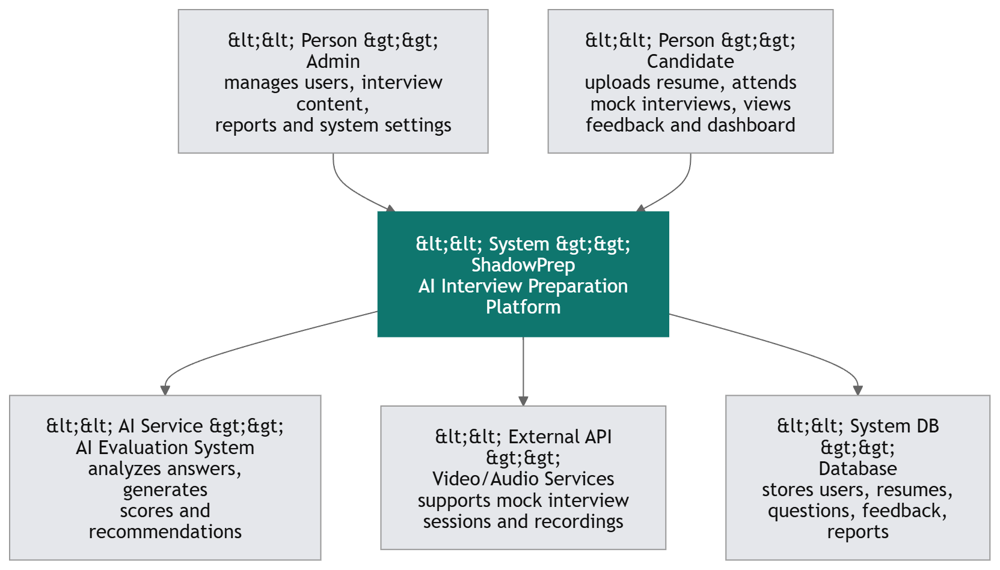

# Software Requirements Specification (SRS)

# ShadowPrep – AI-Based Interview Preparation Platform

----------

## Preface

This document provides the Software Requirements Specification (SRS) for the ShadowPrep System. It defines the functional and non-functional requirements, system architecture, performance expectations, and security measures required for successful development and deployment.

----------

## Version History

-   **Version 1.0** – Initial Draft.

----------

# 1. Introduction

## Purpose

The ShadowPrep System is a web-based interview preparation platform designed to help users improve their technical, behavioral, and communication skills through AI-powered mock interviews, performance analysis, and personalized learning recommendations.

The platform enables users to practice interviews in a realistic environment while receiving instant feedback and progress tracking.

----------

## Document Conventions

This document follows the IEEE SRS standard, using:

-   **Must** – Indicates mandatory requirements.
-   **Should** – Indicates recommended features.
-   **May** – Indicates optional enhancements.

----------

## Intended Audience and Reading Suggestions

-   **Developers & Software Engineers** – For implementation guidance.
-   **Stakeholders & Product Managers** – To understand business features.
-   **QA Teams & Testers** – To validate system functionality.
-   **UI/UX Designers** – To create user-friendly interfaces.

----------

## Scope

The system provides:

-   User authentication and profile management
-   AI-powered mock interviews
-   Technical and behavioral question practice
-   Real-time performance analysis
-   Resume upload and evaluation
-   Progress tracking dashboards
-   Feedback and recommendation systems

----------

## References

-   IEEE Standard 830-1998 (Software Requirements Specification)
-   AI-Based Learning Platform Standards
-   Internal Business Requirement Specification (BRS)

----------

# 2. Overall Description

## Product Perspective

ShadowPrep is a standalone web application that integrates with AI services, speech recognition systems, cloud databases, and video/audio processing APIs.

----------

## Product Functions

-   **Mock Interviews:** Simulate real interview experiences.
-   **AI Evaluation:** Analyze answers and provide feedback.
-   **Question Bank:** Store technical and behavioral interview questions.
-   **Resume Analysis:** Evaluate uploaded resumes.
-   **Progress Tracking:** Monitor user performance over time.
-   **Notifications:** Reminders for practice sessions and updates.

----------

## User Classes and Characteristics

### Admin

-   Manages users, interview content, and analytics.
-   Monitors system performance and reports.

### User/Candidate

-   Participates in mock interviews.
-   Tracks performance and learning progress.
-   Uploads resumes and practice materials.

### Recruiter (Optional Future Role)

-   Reviews candidate interview reports.
-   Creates company-specific interview sets.

----------

## Operating Environment

-   Web-based application accessible through:
    -   Google Chrome
    -   Mozilla Firefox
    -   Microsoft Edge
-   Cloud-hosted infrastructure.
-   **Database:** MongoDB or PostgreSQL.

----------

## Design and Implementation Constraints

-   AI processing should maintain low response latency.
-   User data must comply with privacy regulations.
-   Scalable architecture for increasing user traffic.

----------

## Assumptions and Dependencies

-   Internet connection is required.
-   AI APIs and speech recognition services are available.
-   Future mobile application integration may be implemented.

----------

# 3. System Requirements Specification

# Functional Requirements

## User Authentication

-   The system must allow users to register and log in securely.
-   Users must be able to reset passwords.
-   The system should support Google or LinkedIn login.
-   Role-based access control must be implemented.

----------

## Profile Management

-   Users must be able to create and update profiles.
-   Profiles should include:
    -   Education
    -   Skills
    -   Career goals
    -   Resume uploads
-   Users may upload profile pictures.

----------

## Mock Interview System

-   Users must be able to start mock interviews.
-   The system must support:
    -   Technical interviews
    -   Behavioral interviews
    -   HR interviews
-   AI should ask questions dynamically.
-   Interviews may support voice and video interaction.

----------

## AI Feedback & Evaluation

-   The system must analyze:
    -   Answer accuracy
    -   Communication skills
    -   Confidence level
    -   Response timing
-   AI should generate performance scores.
-   Personalized improvement suggestions should be provided.

----------

## Question Bank Management

-   Admins must be able to add and manage interview questions.
-   Questions should be categorized by:
    -   Programming
    -   HR
    -   Aptitude
    -   System Design
-   Difficulty levels should be supported.

----------

## Resume Analysis

-   Users must be able to upload resumes.
-   AI should evaluate resumes and provide suggestions.
-   Resume scoring should be displayed.

----------

## Dashboard & Progress Tracking

-   Users must be able to track:
    -   Interview history
    -   Performance trends
    -   Skill improvement
-   Admins should access analytics reports.

----------

## Notifications

-   The system must notify users about:
    -   Scheduled interviews
    -   Feedback availability
    -   Practice reminders
    -   System updates

----------

# Non-Functional Requirements

## Performance Requirements

-   The system must support 2000+ concurrent users.
-   AI responses should be generated within a few seconds.
-   Dashboard data should load quickly.

----------

## Security Requirements

-   Passwords must be encrypted.
-   Secure HTTPS communication must be enforced.
-   User interview recordings must be stored securely.
-   Role-based access control must be implemented.

----------

## Usability Requirements

-   The system should provide an intuitive and modern UI/UX.
-   Responsive design must support desktop and mobile devices.
-   Accessibility standards should be followed.

----------

## Reliability and Availability

-   The system must ensure 99.9% uptime.
-   Backup and disaster recovery systems must be implemented.

----------

## Maintainability and Support

-   The system should support modular architecture.
-   Logging and monitoring systems must be implemented.
-   API documentation should be maintained properly.

----------

## Portability

-   The system should support:
    -   Windows
    -   MacOS
    -   Linux
    -   Android
    -   iOS
-   The system must support cloud deployment.

----------

# 4. System Models
   
> -   **CONTEXT DIAGRAM**  
>     Shows interaction between users, admins, AI services, and external APIs.

----------

> -   **ACTIVITY DIAGRAM**  
>     Represents workflows such as interview practice and AI evaluation.

----------

> -   **USE CASE DIAGRAMS**  
>     Includes:
> -   User Use Cases
> -   Admin Use Cases
> -   Resume Analysis Use Cases
> -   Mock Interview Use Cases

----------

> -   **SEQUENCE DIAGRAM**  
>     Describes the process of conducting a mock interview and generating feedback.

----------

> -   **ENTITY-RELATIONSHIP DIAGRAM**  
>     Includes entities such as:
> -   User
> -   Interview
> -   Question
> -   Resume
> -   Feedback
> -   Performance Report

----------

> -   **STATE DIAGRAM**  
>     Represents interview states:
> -   Scheduled
> -   Active
> -   Completed
> -   Evaluated
> -   Cancelled

----------

# 5. System Evolution

## Assumptions

-   AI capabilities will improve over time.
-   Mobile applications may be developed in the future.
-   Enterprise recruitment integration may be added later.

----------

## Expected Changes

-   AI-generated interview questions.
-   Emotion and facial expression analysis.
-   Integration with LinkedIn and job portals.
-   Multi-language interview support.

----------

# 6. Appendices

## Hardware Requirements

-   Cloud-based scalable servers.
-   GPU-enabled AI processing infrastructure.

----------

## Database Requirements

-   Must support scalable and secure data storage.
-   Must maintain logical relationships between interview data and users.

----------

# 7. Glossary

Term

Description

Candidate

User preparing for interviews

Mock Interview

Simulated interview session

AI Feedback

Automated interview evaluation

Resume Score

AI-generated resume rating

Dashboard

User performance tracking panel

Recruiter

Optional user role for hiring purposes
